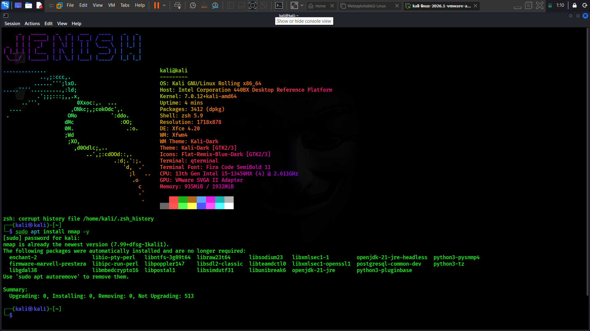

# Task 1 · Basic Network Scanning with Nmap

## Objective
Perform a network scan to identify open ports and running services on a local virtual machine using Nmap, and document the findings with a security analysis.

---

## What is Nmap?

**Nmap** (Network Mapper) is a free, open-source tool used to discover hosts and services on a computer network. It works by sending specially crafted packets to a target machine and analyzing the responses. Nmap can:
- Discover live hosts on a network
- Identify open, closed, and filtered ports
- Detect which services (and their versions) are running on those ports
- Attempt to fingerprint the target's operating system

It is one of the most widely used tools in network security, penetration testing, and system administration.

## Why Network Scanning Matters

Network scanning is a foundational step in cybersecurity for several reasons:
- **Asset discovery** — you cannot secure what you don't know exists on your network.
- **Attack surface visibility** — every open port and running service is a potential entry point for an attacker; scanning reveals what is actually exposed.
- **Vulnerability assessment** — identifying outdated or misconfigured services allows administrators to fix issues before attackers find them.
- **Compliance and auditing** — many security standards require regular network inventory and vulnerability scanning.
- **Baseline monitoring** — comparing scans over time helps detect unauthorized changes, such as a new, unexpected open port.

Attackers use the exact same scanning techniques during reconnaissance, which is why understanding Nmap is essential from a defensive perspective — it lets you see your network the way an attacker would.

## Nmap Installation

This project uses Nmap installed on a Kali Linux virtual machine (VirtualBox), where Nmap comes pre-installed by default.

### Steps followed:

1. Downloaded and installed VirtualBox from virtualbox.org
2. Downloaded the Kali Linux VirtualBox image from kali.org/get-kali and imported it into VirtualBox
3. Booted the Kali Linux VM
4. Verified that Nmap was already installed by running:

   nmap --version

   Example output:

   Nmap version 7.94 ( https://nmap.org )
   Platform: x86_64-pc-linux-gnu

5. If Nmap is not pre-installed (e.g., on a plain Ubuntu VM), it can be installed with:

   sudo apt update
   sudo apt install nmap -y

Screenshort 

