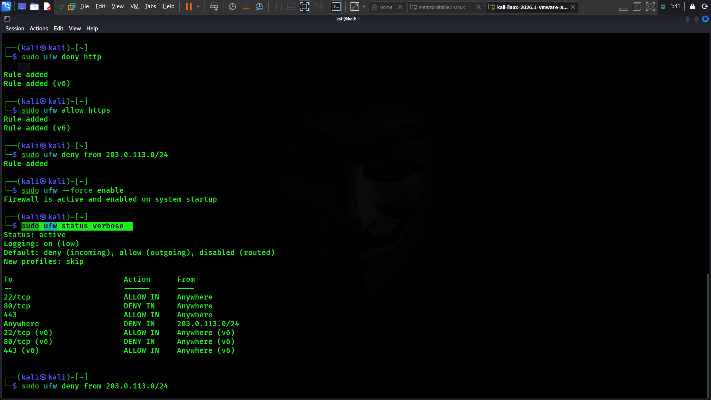

# Task · Basic Firewall Configuration with UFW

## Objective
Set up and configure a basic firewall on a Linux system using UFW (Uncomplicated Firewall), applying rules to allow and deny specific types of traffic.

---

## What Is a Firewall?

A **firewall** is a network security system that monitors and controls incoming and outgoing network traffic based on a defined set of rules. It acts as a barrier between a trusted internal system (or network) and untrusted external networks, deciding which connections are allowed through and which are blocked. Firewalls are one of the most fundamental layers of defense in cybersecurity because they:
- **Reduce attack surface** by blocking access to services/ports that don't need to be exposed
- **Enforce a "default deny" posture** so that only explicitly permitted traffic is allowed
- **Provide visibility and control** over what is entering and leaving a system
- **Help contain the impact** of a compromised or vulnerable service by restricting network exposure

## What is UFW?

**UFW (Uncomplicated Firewall)** is a user-friendly front-end for managing `iptables` (Linux's underlying firewall system). It simplifies firewall configuration into a small set of easy-to-read commands (`allow`, `deny`, `status`, etc.), making it a common choice for quickly securing Ubuntu/Debian-based systems without needing to write raw iptables rules.

---

## Installation

```bash
sudo apt update
sudo apt install ufw -y
```

Verify installation:
```bash
sudo ufw version
```

---

## Rules Applied and Why

| Step | Command | What It Does | Why This Rule Was Chosen |
|---|---|---|---|
| 1 | `sudo ufw default deny incoming` | Blocks all incoming traffic by default | Establishes a secure baseline — nothing gets in unless explicitly allowed |
| 2 | `sudo ufw default allow outgoing` | Allows all outbound traffic by default | The machine still needs to reach the internet/updates/services normally |
| 3 | `sudo ufw allow ssh` (port 22) | Allows incoming SSH connections | SSH is required for remote administration; without this rule, enabling UFW could lock out remote access |
| 4 | `sudo ufw deny http` (port 80) | Blocks incoming HTTP (unencrypted web) traffic | This host does not need to serve plaintext HTTP; blocking it reduces attack surface and prevents accidental exposure of an unencrypted service |
| 5 | `sudo ufw allow https` (port 443) | Allows incoming HTTPS (encrypted web) traffic | If a web service is needed, HTTPS is the secure option; allowing only 443 (not 80) enforces encrypted access |
| 6 | `sudo ufw deny from 203.0.113.0/24` | Blocks all traffic from a specific IP range | Demonstrates the ability to block a known-untrusted or suspicious network range entirely, regardless of destination port |
| 7 | `sudo ufw enable` | Activates the firewall with all configured rules | Rules have no effect until UFW is enabled |

> **Note:** `203.0.113.0/24` is a reserved documentation/example IP range (per RFC 5737) used here to demonstrate the "deny from a specific IP range" rule safely without blocking a real network. Replace it with an actual untrusted range in a real deployment.

---

## Verifying Active Rules

```bash
sudo ufw status verbose
```
To                         Action      From
--                         ------      ----
22/tcp                     ALLOW IN    Anywhere
80/tcp                     DENY IN     Anywhere
443/tcp                    ALLOW IN    Anywhere
Anywhere                   DENY IN     203.0.113.0/24
22/tcp (v6)                ALLOW IN    Anywhere (v6)
80/tcp (v6)                DENY IN     Anywhere (v6)
443/tcp (v6)                ALLOW IN    Anywhere (v6)
```

Screenshot of the actual output: 


## Running the Configuration Script

All rules above are automated in [`ufw_configuration.sh`](./ufw_configuration.sh). To apply them:

```

```bash
chmod +x ufw_configuration.sh
sudo ./ufw_configuration.sh

```

The script installs UFW, sets default policies, applies all allow/deny rules in sequence, enables UFW, and prints the final verified rule set.

---

## ⚠️ Notes / Precautions

- Always allow SSH **before** enabling UFW when working on a remote machine — otherwise you risk locking yourself out.
- Test firewall changes on a local VM first, exactly as done here, before applying to any production system.
- Rules should be reviewed periodically — an "allow" rule that's no longer needed increases unnecessary exposure.

---

## Repository Structure

```
├── README.md
├── ufw_configuration.sh
├── ufw_install.png
├── ufw_status_verbose.png
```
